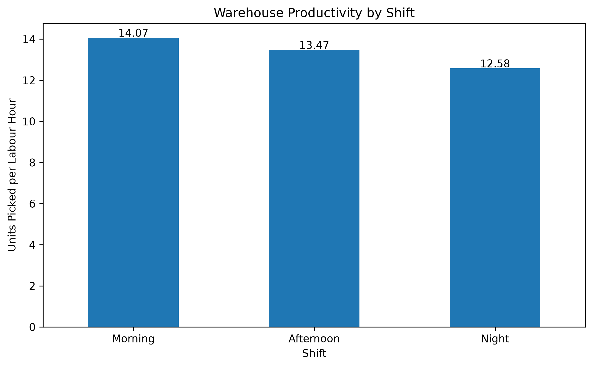
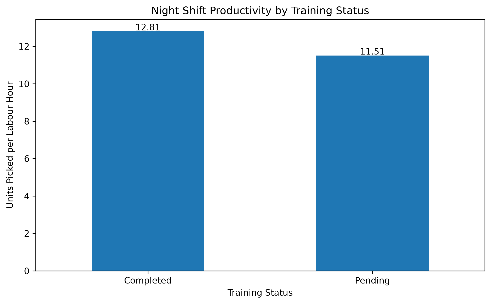
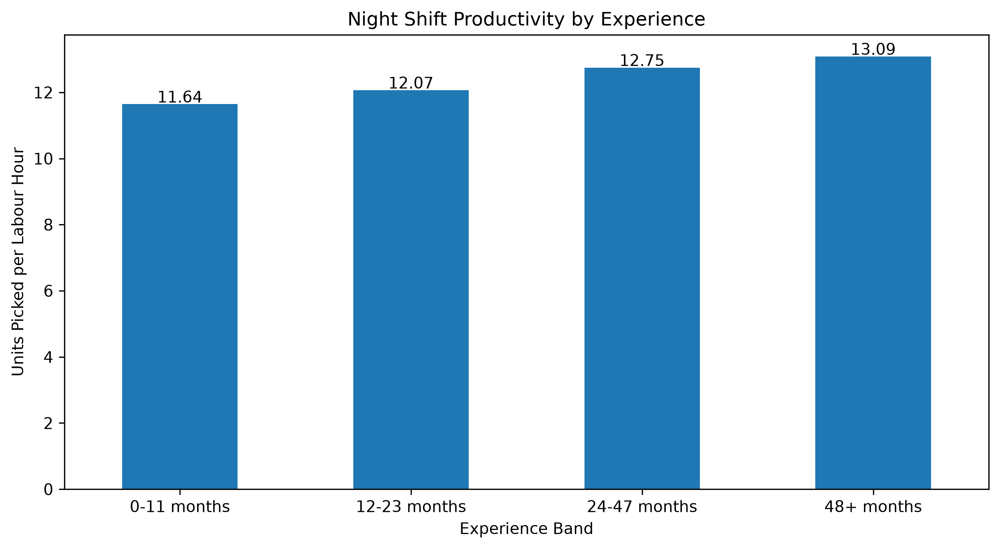
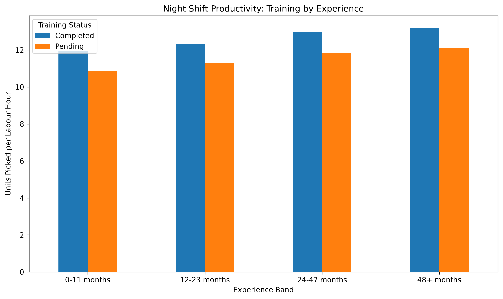

# Warehouse Operations Analytics

End-to-end warehouse operations analytics project using **PostgreSQL, SQL, Python, Pandas, Matplotlib, and Power BI** to analyse productivity, picking accuracy, processing efficiency, overtime, training status, workforce experience, and shift performance.

The goal of this project is to demonstrate how operational data can be transformed into actionable business insights and recommendations.

---

## Project Overview

This project analyses a synthetic warehouse operations dataset containing **50,000 records**.

The analysis focuses on:

- Warehouse productivity
- Picking accuracy
- Order processing time
- Overtime
- Shift performance
- Training completion
- Employee experience
- Warehouse-zone performance
- Operational bottlenecks

The project follows an end-to-end analytics workflow:

```text
Synthetic Warehouse Data
        |
        v
       CSV
        |
        v
   PostgreSQL
        |
        v
       SQL
        |
        v
 Python / Pandas
        |
        v
 Exploratory Data Analysis
        |
        v
   Visualisations
        |
        v
     Power BI
        |
        v
Business Recommendations
```

---

## Business Questions

The project aims to answer questions such as:

1. Which warehouse shift performs best?
2. Which shift has the lowest productivity?
3. Are picking errors higher on certain shifts?
4. Does employee training status affect performance?
5. Does employee experience influence productivity?
6. Are certain warehouse zones creating bottlenecks?
7. Which workforce groups have the highest processing times?
8. Is overtime associated with weaker operational performance?
9. Where should management focus improvement efforts?
10. What factors appear most strongly associated with Night-shift performance?

---

## Dataset

The dataset is synthetically generated using Python to simulate realistic warehouse operations.

The generated dataset contains approximately:

```text
50,000 operational records
18 columns
365 days of activity
250 employees
4 warehouse zones
4 teams
3 shifts
```

The raw CSV is generated locally and intentionally excluded from Git using `.gitignore`.

To regenerate the dataset:

```bash
python python/generate_dataset.py
```

---

## Data Fields

| Column | Description |
|---|---|
| order_id | Unique order identifier |
| order_date | Date of warehouse activity |
| shift | Morning, Afternoon, or Night |
| warehouse_zone | Warehouse operational zone |
| employee_id | Employee identifier |
| team | Employee team |
| product_category | Product category |
| units_picked | Number of units picked |
| hours_worked | Labour hours worked |
| picking_errors | Number of recorded picking errors |
| orders_completed | Number of completed orders |
| target_orders | Expected order target |
| overtime_hours | Overtime hours worked |
| training_status | Completed or Pending |
| experience_months | Employee experience in months |
| order_processing_minutes | Average processing duration |
| sla_minutes | Operational SLA threshold |
| absence_flag | Employee absence indicator |

---

## Technology Stack

### Data and Analytics

- Python
- Pandas
- NumPy
- Matplotlib
- SQL
- PostgreSQL
- Power BI

### Development and Tooling

- Git
- GitHub
- Linux
- Python virtual environments
- PostgreSQL CLI
- Bash

---

## Repository Structure

```text
Warehouse-Operations-Analytics/
|
├── README.md
├── LICENSE
├── requirements.txt
├── .gitignore
|
├── data/
|   ├── raw/
|   |   └── .gitkeep
|   └── processed/
|       └── .gitkeep
|
├── docs/
|   ├── business_questions.md
|   ├── data_dictionary.md
|   ├── insights_and_recommendations.md
|   └── night_shift_analysis_results.txt
|
├── python/
|   ├── generate_dataset.py
|   └── exploratory_analysis.py
|
├── sql/
|   ├── database_setup.sql
|   ├── data_cleaning.sql
|   ├── kpi_analysis.sql
|   ├── shift_analysis.sql
|   ├── workforce_analysis.sql
|   └── night_shift_analysis.sql
|
├── powerbi/
|   └── .gitkeep
|
└── screenshots/
    ├── productivity_by_shift.png
    ├── accuracy_by_shift.png
    ├── night_training_productivity.png
    ├── night_productivity_by_experience.png
    ├── training_by_experience.png
    └── experience_vs_productivity.png
```

---

## Database Setup

PostgreSQL is used as the analytical database.

Create the database:

```bash
sudo -u postgres psql -c "CREATE DATABASE warehouse_analytics;"
```

Create the table structure:

```bash
sudo -u postgres psql \
  -d warehouse_analytics \
  -f sql/database_setup.sql
```

Load the generated CSV:

```bash
sudo -u postgres psql \
  -d warehouse_analytics \
  -c "\copy warehouse_operations FROM '$(pwd)/data/raw/warehouse_operations.csv' WITH (FORMAT csv, HEADER true);"
```

Verify the import:

```bash
sudo -u postgres psql \
  -d warehouse_analytics \
  -c "SELECT COUNT(*) FROM warehouse_operations;"
```

Expected result:

```text
50000
```

---

## Executive KPIs

| KPI | Result |
|---|---:|
| Total Records | 50,000 |
| Total Orders Completed | 1,851,117 |
| Total Units Picked | 5,124,895 |
| Productivity | 13.49 units/hour |
| Picking Accuracy | 97.71% |
| Average Overtime | 0.28 hours per record |

These metrics provide the overall operational baseline for deeper analysis.

---

## Shift Performance

| Shift | Productivity | Accuracy | Avg Processing Time | Overtime Hours |
|---|---:|---:|---:|---:|
| Morning | 14.07 | 97.90% | 21.99 min | 5,552.87 |
| Afternoon | 13.47 | 97.90% | 21.63 min | 4,916.72 |
| Night | 12.58 | 97.11% | 23.30 min | 3,466.83 |

The Night shift showed the weakest overall performance across productivity, accuracy, and processing time.

---

## Key Findings

### 1. Productivity by Shift



**Insight**

Night-shift productivity is lower than Morning and Afternoon shift performance.

**Evidence**

The Morning shift achieved the highest productivity at **14.07 units per labour hour**, followed by the Afternoon shift at **13.47**.

Night-shift productivity was lower at **12.58 units per labour hour**.

**Recommendation**

Investigate Night-shift workforce readiness, staffing mix, workload distribution, and training coverage.

Performance-improvement activity should focus on the Night shift before making wider operational changes.

---

### 2. Night Shift Productivity by Training Status



**Insight**

Training completion is associated with stronger Night-shift performance.

**Evidence**

Employees with completed training achieved:

```text
12.81 units per labour hour
97.28% picking accuracy
23.03 minutes average processing time
```

Employees with pending training achieved:

```text
11.51 units per labour hour
96.24% picking accuracy
24.55 minutes average processing time
```

**Recommendation**

Prioritise completion of outstanding Night-shift training.

Track productivity, accuracy, and processing time before and after training completion to measure whether operational performance improves.

---

### 3. Night Shift Productivity by Experience



**Insight**

Night-shift productivity generally improves as employee experience increases.

**Evidence**

| Experience | Productivity | Accuracy |
|---|---:|---:|
| 0-11 months | 11.64 | 96.71% |
| 12-23 months | 12.07 | 97.06% |
| 24-47 months | 12.75 | 97.18% |
| 48+ months | 13.09 | 97.22% |

Employees with **48+ months of experience** achieved stronger productivity than employees with less than one year of experience.

**Recommendation**

Provide additional coaching and structured support for less-experienced Night-shift employees.

Pairing newer colleagues with experienced employees may help improve productivity while maintaining operational accuracy.

---

### 4. Training Status by Experience Level



**Insight**

Training completion is associated with stronger performance across every Night-shift experience band.

**Evidence**

| Experience | Completed Training | Pending Training |
|---|---:|---:|
| 0-11 months | 11.94 | 10.87 |
| 12-23 months | 12.34 | 11.28 |
| 24-47 months | 12.95 | 11.82 |
| 48+ months | 13.19 | 12.11 |

In every experience group, employees with completed training achieved higher productivity than those with pending training.

The same pattern was also visible in picking accuracy and processing efficiency.

**Recommendation**

Treat training completion as an operational priority across all experience groups rather than focusing only on new employees.

Use ongoing KPI monitoring to assess whether completed training continues to correlate with stronger performance.

---

## Warehouse Zone Analysis

| Zone | Productivity | Accuracy | Avg Processing Time |
|---|---:|---:|---:|
| Zone C | 12.54 | 97.08% | 23.25 min |
| Zone D | 12.58 | 97.10% | 23.34 min |
| Zone B | 12.59 | 97.12% | 23.24 min |
| Zone A | 12.59 | 97.13% | 23.39 min |

The relatively small differences between zones suggest that warehouse-zone allocation is unlikely to be the primary explanation for Night-shift underperformance.

---

## Analytical SQL

The project demonstrates SQL techniques including:

```text
SELECT
GROUP BY
HAVING
CASE
CTEs
Subqueries
Aggregations
DATE functions
Window functions
RANK()
ROW_NUMBER()
LAG()
SUM() OVER()
AVG() OVER()
```

The dedicated Night-shift investigation is available in:

```text
sql/night_shift_analysis.sql
```

---

## Python Exploratory Data Analysis

Python is used to validate the dataset, calculate KPIs, and create visualisations.

The EDA script:

```text
python/exploratory_analysis.py
```

generates:

```text
productivity_by_shift.png
accuracy_by_shift.png
night_training_productivity.png
night_productivity_by_experience.png
training_by_experience.png
experience_vs_productivity.png
```

Run:

```bash
python python/exploratory_analysis.py
```

Charts are saved to:

```text
screenshots/
```

---

## Overall Business Conclusion

The analysis identified the **Night shift** as the main operational area requiring further investigation.

The Night shift demonstrated:

- lower productivity
- lower picking accuracy
- longer average processing times

Warehouse-zone performance remained relatively consistent, while workforce characteristics showed clearer differences.

The strongest patterns were associated with:

- training completion
- employee experience
- Night-shift workforce performance

The analysis therefore suggests focusing improvement efforts on:

1. completing outstanding workforce training
2. providing targeted coaching for less-experienced employees
3. monitoring Night-shift KPIs more closely
4. measuring performance before and after training interventions
5. reviewing staffing and workload distribution on the Night shift

Because the project uses synthetic observational data, these results demonstrate **associations rather than causal relationships**.

---

## Power BI Dashboard

The next stage of the project will include a Power BI dashboard with four analytical pages.

### Executive Overview

- Total Orders
- Total Units Picked
- Productivity
- Picking Accuracy
- SLA Compliance
- Overtime

### Shift Performance

- Morning shift
- Afternoon shift
- Night shift
- Productivity
- Accuracy
- Processing time
- Target achievement

### Workforce Analytics

- Employee experience
- Training status
- Productivity
- Accuracy
- Overtime

### Bottleneck Analysis

- Warehouse zones
- Workload
- Product category
- Processing time
- Operational bottlenecks

---

## Future Development

```text
Warehouse Data
      |
      v
    AWS S3
      |
      v
  Python ETL
      |
      v
PostgreSQL / RDS
      |
      v
 SQL Analytics
      |
      v
   Power BI
```

Potential future improvements include:

- AWS S3 ingestion
- automated ETL pipelines
- Amazon RDS PostgreSQL
- scheduled data processing
- cloud-hosted analytics
- Power BI dashboard integration
- advanced statistical analysis
- forecasting
- anomaly detection
- operational KPI alerting

---

## Skills Demonstrated

### Data Analytics

- SQL
- PostgreSQL
- Python
- Pandas
- Exploratory Data Analysis
- Data cleaning
- KPI analysis
- Data visualisation
- Business analytics

### Business Analysis

- Business-question definition
- KPI design
- Root-cause investigation
- Workforce analysis
- Operational performance analysis
- Evidence-based recommendations

### Engineering

- Linux
- Git
- GitHub
- Database setup
- Python environments
- Reproducible analytics workflows

---

## Run the Project

```bash
git clone git@github.com:NikMir15/Warehouse-Operations-Analytics.git
cd Warehouse-Operations-Analytics

python3 -m venv .venv
source .venv/bin/activate

pip install -r requirements.txt

python python/generate_dataset.py
python python/exploratory_analysis.py
```

---

## Project Status

- [x] Repository structure
- [x] Synthetic data generation
- [x] Dataset validation
- [x] PostgreSQL database
- [x] SQL KPI analysis
- [x] Shift analysis
- [x] Night-shift investigation
- [x] Training analysis
- [x] Experience analysis
- [x] Python exploratory analysis
- [x] Data visualisations
- [ ] Power BI dashboard
- [ ] Cloud analytics pipeline
- [ ] AWS deployment

---

## Author

**Nikunj Mirajkar**

Cloud, Platform & Data Engineer

**LinkedIn:**  
https://www.linkedin.com/in/nikunjmirajkar/

**GitHub:**  
https://github.com/NikMir15

**Portfolio:**  
https://nikunjmirajkar.com/

---

## Disclaimer

This project uses **synthetically generated warehouse data** for educational and portfolio purposes.

It does not contain confidential, proprietary, or real operational data from any employer or organisation.
